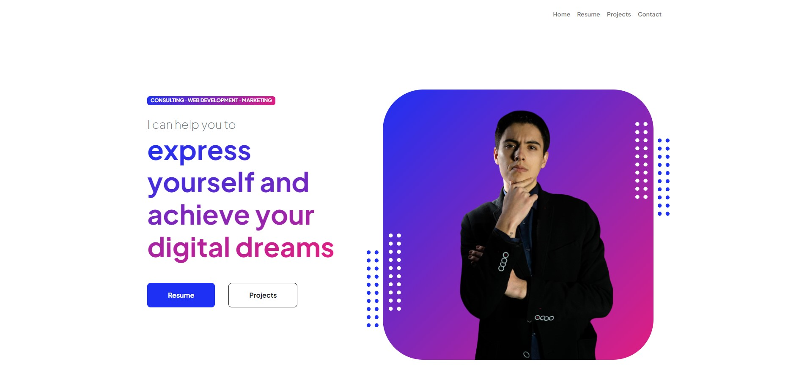
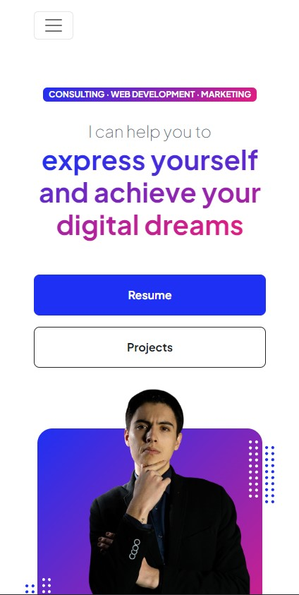

# My Portfolio Website

## Description

This is the codebase for the Responsive portfolio website of mine. The site is used to showcase my skills, work, and professional background.

The site consists of the following pages:

1. **Home**: The landing page of the website.
2. **Resume**: A page that contains my professional background and skills.
3. **Projects**: A page that showcases the projects I worked on.
4. **Contact**: A page that contains contact information and a form for visitors to reach out to me.

## The landing page:

### On a large screen:

### On a mobile screen:

## Project Architecture

The main HTML file is `index.html`, with additional HTML files for each of the other pages (`resume.html`, `projects.html`, `contact.html`).

The project uses the following external resources:

### Stylesheets

1. Google Fonts - [Plus Jakarta Sans](https://fonts.googleapis.com/css2?family=Plus+Jakarta+Sans:wght@100;200;300;400;500;600;700;800;900&display=swap)
2. Bootstrap Icons - [bootstrap-icons.css](https://cdn.jsdelivr.net/npm/bootstrap-icons@1.8.1/font/bootstrap-icons.css)
3. Custom styles - `css/styles.css`

### Scripts

1. Bootstrap Bundle - [bootstrap.bundle.min.js](https://cdn.jsdelivr.net/npm/bootstrap@5.2.3/dist/js/bootstrap.bundle.min.js)
2. Custom scripts - `js/scripts.js` (an unused form script kept in the project for future learning purposes.)

### Images

1. In `dist/assets` you will find both the favicon of the website and the main image of myself.

## Meta Information and SEO

The website contains the following meta information:

- Title: `Radoslav Sheytanov - Freelance Web Developer`
- Description: `My name is Radoslav Sheytanov-Ruxton and I help people express themselves digitally.`
- Keywords: `Web, Developer, About Me, Resume, Radoslav, -, Contact, express yourself and achieve your digital dreams, Freelance, Home, Projects, ..., Sheytanov`
- SEO Customised Schema Markup Script

## Social Links

1. [Twitter](https://twitter.com/SheytanovR)
2. [LinkedIn](https://www.linkedin.com/in/radoslav-sheytanov-771a43260/)
3. [GitHub](https://github.com/RadoslavSheytanov)

## Resources

1. [Bootstrap CSS Framework](https://www.getbootstrap.com/)
2. [StartBootstrap](https://www.startbootstrap.com/)
3. [Contact Form Handling by FormSubmit.co](https://www.formsubmit.co/)
4. [Background Removal and Basic Image Editing](https://www.remove.bg)
5. [Google's Schema Markup Checking Tool](https://developers.google.com/search/docs/appearance/structured-data)

## Setup & Deployment

### Basic Set-up

Clone the repository and preview the `dist` folder. To preview the changes you make to the code, you can open the `index.html` file in your web browser or via Live Server.

### Advanced Usage and Set-up

Clone the source files of the theme and navigate into the theme's root directory. Run `npm install` and then run `npm start` which will open up a preview of the template in your default browser, watch for changes to core template files, and live reload the browser when changes are saved. You can view the `package.json` file to see which scripts are included.

#### npm Scripts

* `npm run build` builds the project - this builds assets, HTML, JS, and CSS into `dist`
* `npm run build:assets` copies the files in the `src/assets/` directory into `dist`
* `npm run build:pug` compiles the Pug located in the `src/pug/` directory into `dist`
* `npm run build:scripts` brings the `src/js/scripts.js` file into `dist`
* `npm run build:scss` compiles the SCSS files located in the `src/scss/` directory into `dist`
* `npm run clean` deletes the `dist` directory to prepare for rebuilding the project
* `npm run start:debug` runs the project in debug mode
* `npm start` or `npm run start` runs the project, launches a live preview in your default browser, and watches for changes made to files in `src`

You must have npm installed in order to use this build environment.
